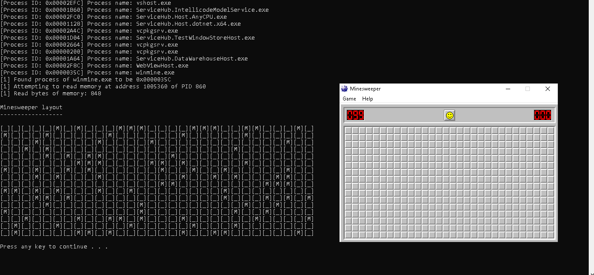
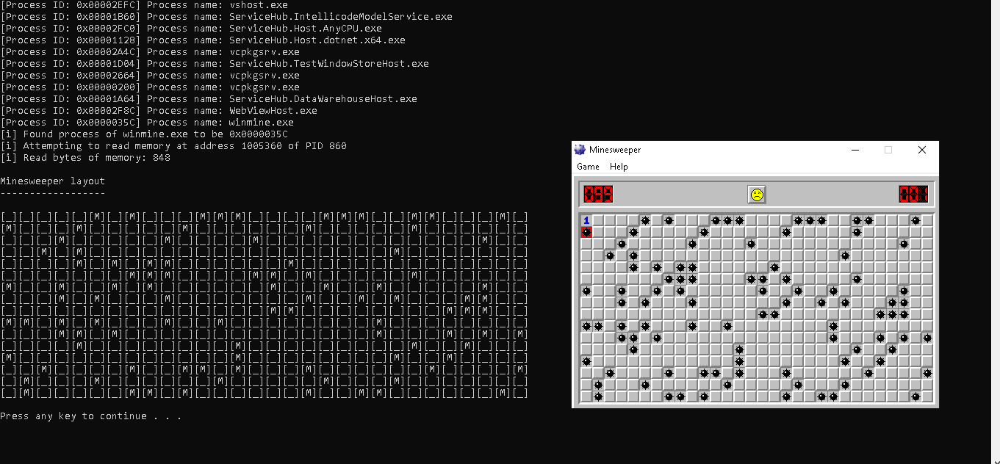

# MineSweeperLayout

This code will display the layout of the mines in Minesweeper before the game is played.

The Winmine.exe process is searched for, then the memory location of the mines is then read and displayed.

